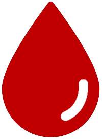

---
output:
  html_document:
    theme: null
    highlight: null
    css: styles.css
    includes:
      in_header: header.html
---

```{r knitr_init, echo=FALSE, cache=FALSE}
library(knitr)

## Global options
opts_chunk$set(echo=FALSE,
	             cache=FALSE,
               prompt=FALSE,
               tidy=TRUE,
               comment=NA,
               message=FALSE,
               warning=FALSE)
#opts_knit$set(width=75)
```

```{r load_packages}
library(tidyverse)
library(readxl)
library(leaflet)
library(leaflet.extras)
library(rgdal)

# source("init.r")
```

```{r load_bounds, message=FALSE, warning=FALSE, include=FALSE, paged.print=FALSE}
source("prep brexit.r")
source("prep hunger.r")

col_rc_grey = "#5C747A"
col_rc_grey_light = "#9CAAAE"

# pal = colorNumeric("magma", c(0, max(ilcr_bounds@data$Total)), reverse = T)
pal_hunger = colorFactor("YlGnBu", msoa_bounds@data$RiskRateQ)
# pal_engage = colorFactor("Greens", lrf_bounds@data$Total_bin)

ship_icon = makeIcon("images/anchor.png", 20, 23)
plane_icon = makeIcon("images/plane.png", 19, 20)
bang_icon = makeIcon("images/bang.png", 20, 20)
blood_icon = makeIcon("images/blood.png", 27, 20)

trust_icons = iconList(
  red   = makeIcon("images/hospital-red.png",   20, 20),
  amber = makeIcon("images/hospital-amber.png", 20, 20),
  green = makeIcon("images/hospital-green.png", 20, 20)
)
```

<!--html_preserve-->
<!-- Google Tag Manager (noscript) -->
<noscript><iframe src="https://www.googletagmanager.com/ns.html?id=GTM-KKTZ7CB"
height="0" width="0" style="display:none;visibility:hidden"></iframe></noscript>
<!-- End Google Tag Manager (noscript) -->

<style type="text/css">
.tg  {border-collapse:collapse;border-spacing:0;border:none;}
.tg td{padding:1px 5px;border-style:solid;border-width:0px;overflow:hidden;word-break:normal;}
.tg .tg-us36{border-color:inherit;vertical-align:top}
</style>

<div style="z-index: 1; position: absolute; top: 0px; left: 50px; background-color: rgba(255, 255, 255, 0.6); padding: 5px 5px 5px 5px; font-size: 12px">
  <h3>EU exit risk map</h3>
  <p>&nbsp;represents hospitals (Scotland and NI) or Trusts (England and Wales).<br/>
  They are colour-coded by their performance in terms of A&E waits and <br/>
  delayed discharges, and ranked on performance within each IL/CR area.<br/>
  See our <a href="http://data.redcross.org.uk/nhs" target="_blank">State of the NHS map</a> for more details.</p>
  <p>&nbsp;shows permanent blood donation centres.</p>
  <p>&nbsp;shows airports.</p>
  <p>&nbsp;shows ports.</p>
  <p>&nbsp;shows other risks: Dover, London and the NI border.<br/>
  The blue lines show the M20 and A55.</p>
  <p>The 'food insecurity' layer shows household-level risk of food insecurity <br/>
  in English neighbourhoods containing 2-6,000 households.<br/>
  Darker colours mean higher risk of food insecurity.</p>
</div>
<!--/html_preserve-->

```{r map}
leaflet(ports,
        width = "100%", height = "100%", padding = 0,
        options = leafletOptions(minZoom = 5, maxZoom = 12, attributionControl = T)) %>% 
  
  # centre map on Whitendale Hanging Stones, the centre of GB: https://en.wikipedia.org/wiki/Centre_points_of_the_United_Kingdom
  setView(lat = 54.00366, lng = -2.547855, zoom = 7) %>%
  addProviderTiles(providers$CartoDB.Positron) %>% 
  
  # hospitals/Trusts
  addMarkers(data = nhs,
             lng = ~Longitude, lat = ~Latitude,
             icon = ~trust_icons[RAG],
             
             label = ~Name,
             popup = ~paste(popuptext),
             group = "Hospitals/Trusts") %>% 
  
  # blood donation centres
  addMarkers(data = blood,
             lng = ~Longitude, lat = ~Latitude,
             icon = blood_icon,
             label = ~Name,
             group = "Blood donation centres") %>%

  # ports
  addMarkers(data = ports,
             lng = ~lng, lat = ~lat,
             icon = ship_icon,
             label = ~name,
             group = "Roads, ports and airports") %>%
  
  # airports
  addMarkers(data = airports,
             icon = plane_icon,
             label = ~Name,
             group = "Roads, ports and airports") %>% 
  
  # roads
  addPolygons(data = m20, weight = 3, color = "blue", label = "M20", group = "Roads, ports and airports") %>% 
  addPolygons(data = a55, weight = 3, color = "blue", label = "A55", group = "Roads, ports and airports") %>% 
  
  # points for Dover, London and NI border
  addMarkers(data = other_points, icon = bang_icon, label = ~what, group = "Other risks") %>% 
  
  # hunger
  addPolygons(data = msoa_bounds,
              weight = 1, smoothFactor = 0.5, fillOpacity = 0.7,
              color = col_rc_grey, fillColor = ~pal_hunger(RiskRateQ),
              highlightOptions = highlightOptions(color = col_rc_grey_light, weight = 2, bringToFront = T),

              label = ~msoa11nm,

              popup = ~paste(
                "<b>", msoa11nm, "</b><br/><br/>",
                "Risk quintile: ", RiskRateQ
              ),
              group = "Food insecurity") %>%

  # addLegend("bottomright", pal = pal_hunger,
  #           values = ~Total,
  #           title = "No. Crisis Response people",
  #           opacity = 1
  # ) %>%
  
  addLayersControl(
    overlayGroups = c("Hospitals/Trusts", "Blood donation centres", "Roads, ports and airports", "Other risks", "Food insecurity"),
    options = layersControlOptions(collapsed = FALSE)
  ) %>% 
  
  hideGroup("Food insecurity")
```
